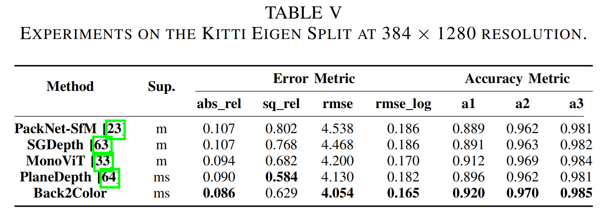

# Back2Color
- This repository is for the paper “Back to the Color: Learning Depth to Specific Color Transformation for Unsupervised Depth Estimation”([paper](https://arxiv.org/pdf/2406.07741))
- The Code will be coming soon.

## The continuous prediction capability

  

## The State-of-the-Art Results of our Back2Color

